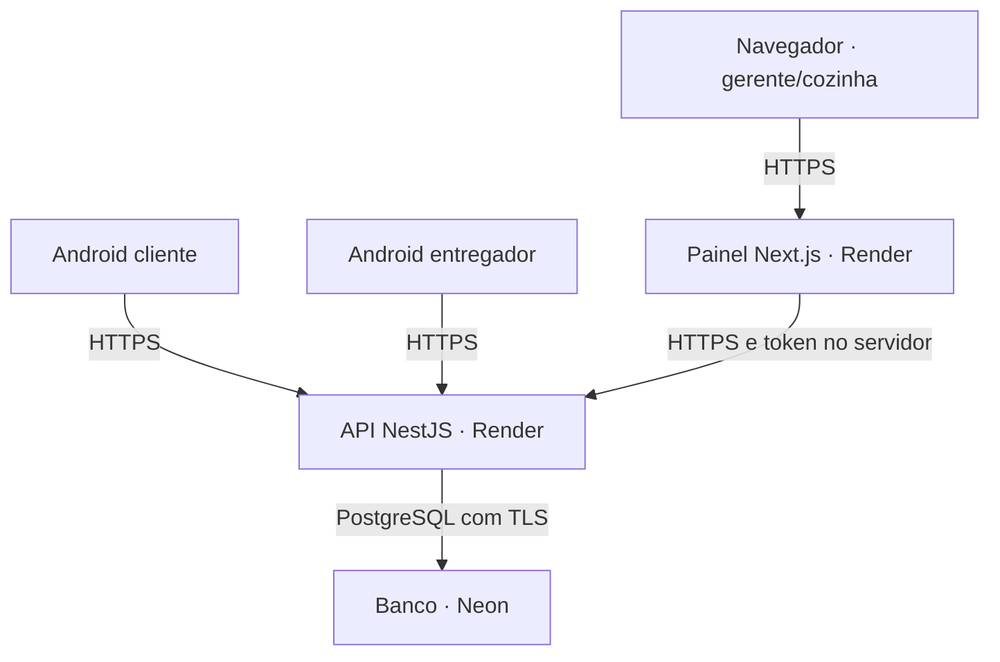

# 1. Arquitetura e ambientes

## O sistema não depende de um PC ligado na pizzaria

Quando hospedado, API e banco ficam na nuvem. O painel e os Androids precisam de internet para sincronizar. A fila local dos apps ajuda a reconciliar uma operação interrompida; **não transforma o sistema em um PDV offline completo**.

O navegador usa o servidor do painel como intermediário (BFF). O token fica em cookie autenticado e criptografado, não em localStorage. Os aplicativos nativos falam diretamente com a API. Nenhum cliente recebe a senha do PostgreSQL.

O painel é **Next.js com execução no servidor**, não um Static Site: login e encaminhamento autenticado dependem de Node. As fotos de produtos atuais são armazenadas no PostgreSQL; entram no backup do banco. Não dependem de pasta persistente no container.

## Separação mínima

| Ambiente | Finalidade | Dados | Acesso |
| --- | --- | --- | --- |
| Local/teste | Desenvolver e executar CI | Dados fictícios, banco descartável | Desenvolvedor/CI |
| Homologação (staging) | Ensaiar a versão antes do lançamento | Fictícios, contas específicas | Equipe de teste |
| Produção | Operar pedidos reais | Clientes, pedidos e equipe reais | Somente autorizados |

Cada ambiente deve ter banco, credenciais, URLs e segredo de sessão próprios. Prefira projetos separados no Neon para reduzir confusão. Uma branch criada a partir de produção pode conter **todos os dados pessoais de produção**: não é automaticamente uma base segura para testes.

Não configure TEST_DATABASE_URL com a URL de produção. Os testes alteram dados; o nome do banco conter “test” é uma barreira auxiliar, não isolamento de segurança.

## Render continua sendo uma opção

API Docker e painel Node podem permanecer no Render. Para a operação real, escolha recursos que não durmam por inatividade e dimensione CPU/RAM após medir. O serviço Free é adequado à demonstração, não ao compromisso de atendimento. [Limitações oficiais do Free](https://render.com/docs/free).

A loja pode ficar fechada para preparo e continuar recebendo reservas; por isso a API precisa estar acessível fora do horário de produção. A rotina de horários roda enquanto o processo está ativo, com reconciliação quando volta. Não use pings para contornar a suspensão do plano Free.

Escolha API e banco em regiões próximas quando possível. Confirme as regiões nos painéis: não presuma que o Neon existente está na mesma região do Render. Meça a latência antes de migrar dados; mudar região é uma operação planejada.

## Decisões que precisam ficar registradas

| Decisão | Sugestão inicial | Quem confirma |
| --- | --- | --- |
| Propriedade de domínio/nuvem | Conta da pizzaria, desenvolvedor como colaborador | Pizzaria |
| API definitiva | api.seu-dominio.example ou origem HTTPS estável do Render | Ambos |
| Painel definitivo | painel.seu-dominio.example | Ambos |
| Distribuição dos Androids | Piloto restrito; decidir APK direto ou Google Play | Pizzaria |
| Dados e retenção | Política explícita, coleta mínima | Pizzaria + assessoria |
| Suporte | Horários, canal, incidentes e mudanças incluídas | Contrato |
| Recuperação | Meta inicial proposta: RPO 15 min / RTO 60 min | Validar com ensaio e orçamento |

RPO é quanto dado se admite perder após falha. RTO é quanto tempo se admite ficar indisponível. Esses números são **metas para discutir**, não garantias do código ou do plano contratado.

## Custos que não podem ser esquecidos

API, painel, banco/armazenamento/retensão de backups, tráfego, domínio anual, monitoramento, suporte e eventual conta de loja de aplicativos. E-mail/SMS/WhatsApp, gateway de pagamentos e fiscal são integrações separadas quando adotadas.

Não prometer preço mensal fixo de nuvem sem conferir a cotação do plano, limites e moeda. Separar no contrato custo de infraestrutura, manutenção corretiva, plantão e novas funcionalidades.
